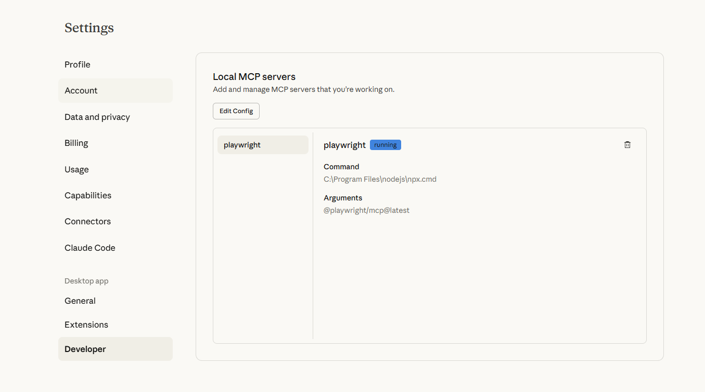
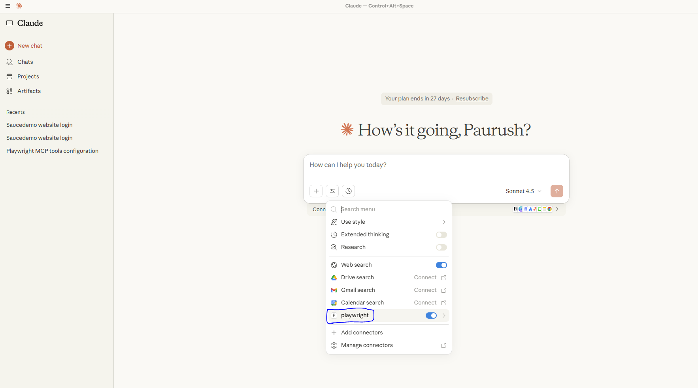
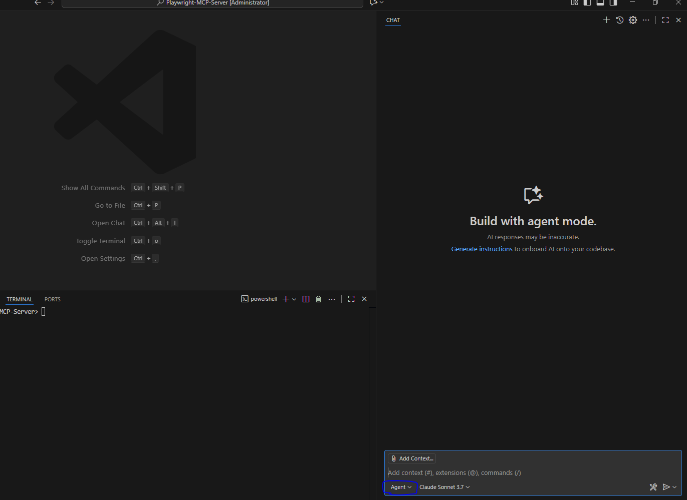
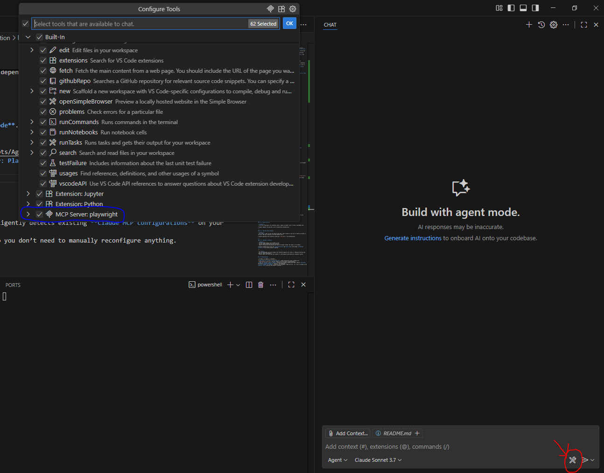

# AI-Powered Playwright Automation  
### *Claude MCP + GitHub Copilot Integration Guide*

<p align="center">
  
  
  
  
  
</p>

---

## 🧠 Overview

This project showcases how to integrate **Claude Desktop**, **Playwright MCP**, and **GitHub Copilot (Agent Mode)**  
to create a smart, AI-assisted test automation environment where test cases and step definitions can be  
generated dynamically — without writing code manually.

###  What is MCP and Why Use It?

The **Model Context Protocol (MCP)** is an open standard that allows you to run and connect **local or custom AI tools** (known as *MCP servers*) with your LLM client — such as **ChatGPT**, **Claude**, or other AI models.  

Instead of relying entirely on cloud APIs, MCP lets your AI communicate directly with your **own code, data, and local environment** — securely and privately.

> 🧠 **Think of MCP as a bridge** between your AI assistant and your local tools, scripts, or data — allowing it to *see*, *run*, and *use* resources on your computer safely.

---

###  How MCP Differs from Normal LLM Usage


| **Feature** | **Normal ChatGPT / Cloud LLM** | **MCP Server Setup** |
|--------------|--------------------------------|-----------------------|
| **Environment** | Fully cloud-based; runs on OpenAI servers | Runs **locally** on your system |
| **Data Access** | Limited to what you manually paste or upload | Can securely access **local files, APIs, or tools** |
| **Customization** | Dependent on built-in model capabilities | Fully **customizable** — define your own logic and tools |
| **Latency & Privacy** | Data sent to remote servers | Data stays **on your machine**, improving **privacy and speed** |
| **Integration** | Suited for general-purpose chat | Perfect for **automation**, **testing**, and **system integration** |

---

###  Why MCP Servers Are Useful

The **MCP Server** architecture enables powerful, local, and secure extensions for your LLM:

-  **Local Control** – You decide exactly what the model can access or execute — no cloud dependency.  
-  **Custom Tools** – Expose your own APIs, databases, or scripts as callable “tools.”  
-  **Automation Ready** – Let your LLM *do things*, not just chat — like running Playwright tests or managing files.  
-  **Developer Friendly** – Perfect for integrating AI into **local dev environments** or **CI/CD pipelines**.  

---

### 💻 Runs Locally

When you run an **MCP Server** (such as the **Playwright MCP Server**), it operates **directly on your system**.

That means:

-  It can interact with your **local environment, files, and installed tools**.  
-  No sensitive data leaves your computer — it all stays local.  
-  You have **complete control** over what the AI can and cannot do.

---

## 📋 Table of Contents

1. [Overview](#overview)
2. [Prerequisites](#prerequisites)
3. [Installation](#installation)
4. [Configuration](#configuration)
5. [Testing the MCP Server](#testing-the-mcp-server)
6. [Running the Project](#running-the-project)
7. [Using GitHub Copilot Agent](#using-github-copilot-agent)
8. [Example Prompts](#example-prompts)
9. [Troubleshooting](#troubleshooting)
10. [Conclusion](#conclusion)

---

## ⚙️ Prerequisites

Ensure you have the following tools installed:

- [Node.js](https://nodejs.org/en/download/) (v16 or later)
- [Playwright](https://playwright.dev/)
- [GitHub Copilot](https://github.com/features/copilot) with **Copilot Chat**
- [Claude Desktop](https://claude.ai/download)

---

## 🧩 Installation

### 1️⃣ Clone the Repository

```
git clone https://github.com/PaurushVishnoi/Playwright-MCP-Server.git
```

### 2️⃣ Create a .env File

Create a .env file in the root directory with the following contents:

```
UI_baseURL=https://sauce
exmox_USERNAME=standard_user
exmox_PASSWORD=secret_sauce
```

## 🔧 Configuration

### ⚙️ Configure Claude Desktop MCP Server for Playwright

1. **Open Claude Desktop Settings**
   - Go to **Settings → Developer → Edit config**
   - This opens the file: `claude_desktop_config.json` (it may be empty)


2. **Paste the following configuration:**

   ```json
   {
     "mcpServers": {
       "playwright": {
         "command": "C:\\Program Files\\nodejs\\npx.cmd",
         "args": ["@playwright/mcp@latest", "--stdio"]
       }
     }
   }
   ```

3. **Save the file and restart Claude Desktop**

4. **Once restarted, you should see Playwright tools appear automatically in Claude Desktop**





## 🧪 Testing the MCP Server

To confirm that your Playwright MCP setup is working correctly, follow these steps:

1. Open **Claude Desktop**.  
2. In the chat, run the following prompt:

   > **Prompt:**  
   > “Navigate to the website https://www.saucedemo.com/”

3. After a few seconds, you should see a **Playwright browser window** open automatically and navigate to the given URL.

   ✅ **Expected Result:**  
   The website `https://www.saucedemo.com/` loads successfully in the Playwright browser.

   🎉 **Congratulations!**  
   Your **MCP server** is active and fully functional.

   

---

> 💾 **Note:**  
> If you haven’t already, make sure to **save** your configuration file (`claude_desktop_config.json`)  
> and **restart Claude Desktop**.  
> After restarting, you should now see the **Playwright tools** appear automatically inside Claude Desktop.


## ▶️ Running the Project

Before running the tests, make sure you have the following installed:

- ✅ **Node.js**
- ✅ **Playwright**
- ✅ **GitHub Copilot** (with **Copilot Chat** enabled)

---

### 🧱 Install Dependencies

Run the following command in your project directory:

```bash
npm install
```

This will install all the required dependencies listed in your package.json.


## 🤖 Using GitHub Copilot Agent

### 1️⃣ Open Copilot Agent
1. Open **Copilot Chat** in **VS Code**.  
2. Switch to **Agent Mode**. 



3. You’ll notice that **“MCP Server: Playwright”** is already configured.


---

### 💡 Why It Works Automatically

The **GitHub Copilot Agent** intelligently detects existing **Claude MCP configurations** on your system  
and imports them automatically — so you don’t need to manually reconfigure anything.

---

## 💬 Example Prompts

### 🧩 1. Update Base URL

> **Prompt:**  
> “You are a Playwright test automation expert. Update my baseUrl value to https://saucedemo.com/”

✅ Copilot updates the base URL in your configuration automatically.

---

### 🧪 2. Generate Test Scenarios

> **Prompt:**  
> “As a user, I want to test the feature that when I add a product to the cart it should be visible in the cart. 

> Add test scenarios in the e2e.feature file. put the tag @cart to the scenarios”

✅ Copilot generates test scenarios inside your `e2e.feature` file automatically with tags @cart.

---

### ⚙️ 3. Automate a Scenario

> **Prompt:**  
> “Verify single product can be added to cart.  
> Can you please automate the first scenario?  
> Ignore rewriting the step definitions that are already created. Use login.js to proceed.”

✅ Copilot automatically writes the **step definition** and **test code** with proper **Playwright selectors** — all without manual scripting!

---

> 💬 **Tip:**  
> You can experiment with more prompts like “Generate negative test cases” or “Optimize existing test steps for faster execution.”  
> Copilot Agent and Claude MCP work together to intelligently understand your automation context.


## 🧯 Troubleshooting

| 🧩 Issue | ⚙️ Cause | 💡 Solution |
|-----------|-----------|-------------|
| **MCP server not visible in Claude Desktop** | JSON configuration issue | Recheck your `claude_desktop_config.json` file for syntax errors and restart Claude Desktop. |
| **MCP not loading in Copilot Agent** | Missing sync between Claude and VS Code | Restart **VS Code** and ensure **Claude Desktop** is running in the background. |
| **.env variables not loaded** | Incorrect file placement | Make sure the `.env` file is located in the **project root** directory and properly formatted. |
